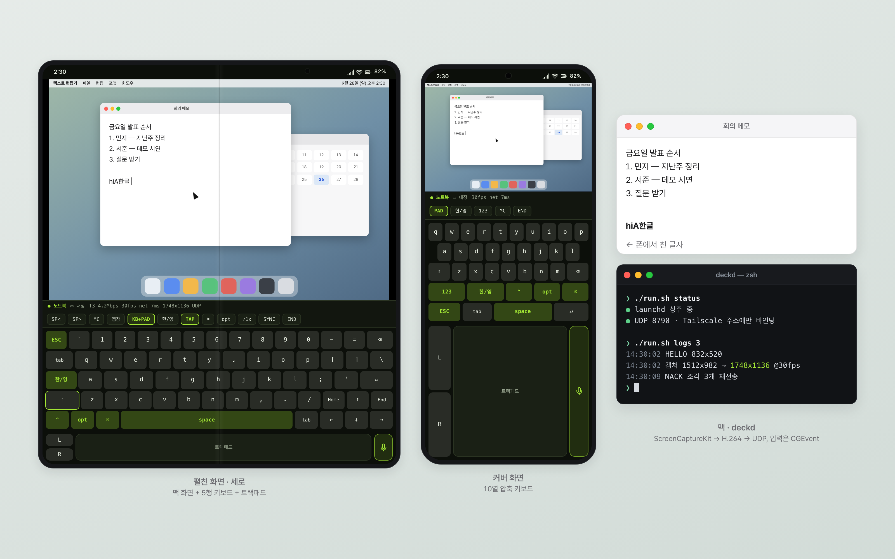
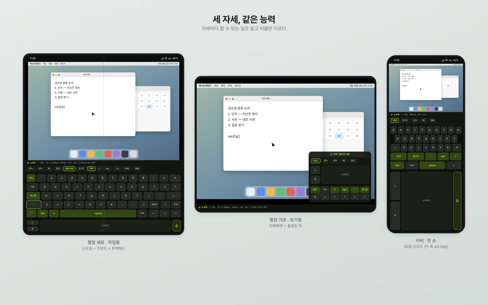
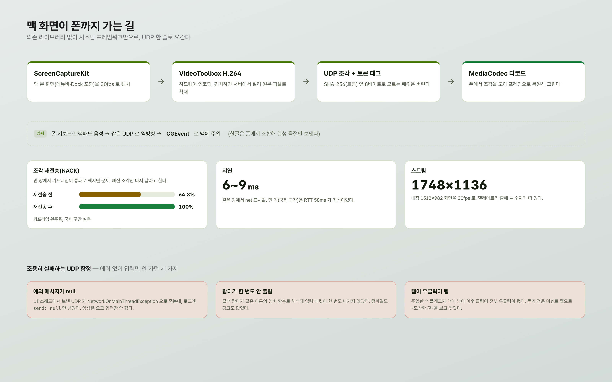
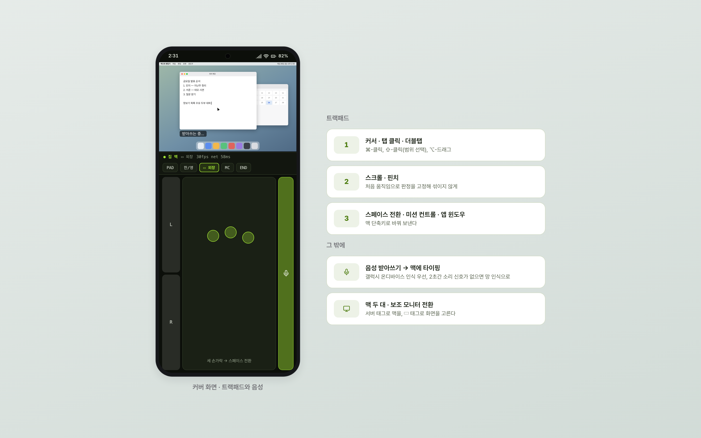
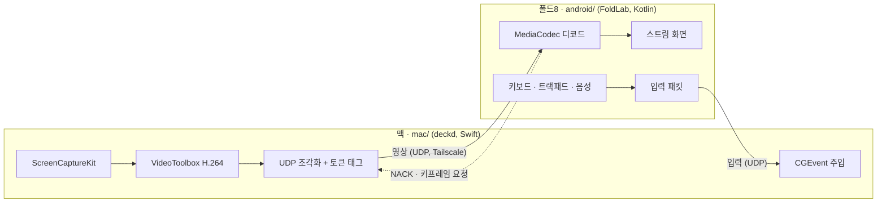

# fold-cyberdeck

갤럭시 Z 폴드8에서 맥 화면을 실시간으로 보고, 키보드·트랙패드·음성으로 조작하는 사이버덱입니다.

> **English** — A phone-as-cyberdeck for macOS: the Galaxy Z Fold8 shows the Mac's real desktop (menu bar and Dock included) and drives it with an on-screen keyboard, trackpad gestures and voice dictation.
> The Mac side (`mac/`, "deckd") is pure Swift with zero dependencies: ScreenCaptureKit → VideoToolbox H.264 → UDP, and CGEvent for input. The phone side (`android/`, "FoldLab") is Kotlin + Jetpack Compose.
> Built for personal use over Tailscale; 30 fps, 6–9 ms on the same network, and fragment retransmission (NACK) that took keyframe completion from 64% to 100% on a long-haul link.

동작 확인: Galaxy Z Fold8 (Android 17) · macOS 26


화면은 설명용 목업입니다.

## 왜 만들었나

저는 10년 넘게 아이폰을 쓰다가 갤럭시 Z 폴드8로 넘어왔습니다. 맥은 그대로라서 아이폰 시절에 당연하던 맥 연동이 사라졌고, 필요한 건 하나씩 직접 만들어 보기로 했습니다. 이 저장소는 그중 하나입니다.

계기는 폴더블 폰으로 맥을 원격 조작하는 상용 앱의 짧은 영상이었습니다. 처음엔 터미널 세션 조작기인 줄 알고 설계를 시작했는데, 영상을 고해상도로 다시 분석해 보니 데스크톱 화면 전체를 픽셀로 스트리밍하는 방식이었습니다. 그래서 설계를 뒤집고 맥 화면 스트리밍과 입력 주입을 처음부터 직접 만들었습니다. 영상에서 영감을 받았을 뿐, 그 앱의 코드나 자산은 쓰지 않았습니다.

## 스크린샷


화면은 설명용 목업입니다.


화면은 설명용 목업입니다.


화면은 설명용 목업입니다.

## 기능

- **맥 본 화면 스트리밍** — 메뉴바·Dock 포함. 내장 1512×982 화면을 1748×1136 스트림, 30fps로 보냅니다. 같은 망에서 텔레메트리 줄의 net 값은 6~9ms였습니다.
- **조각 재전송(NACK)** — 먼 망에서 키프레임이 통째로 깨지던 문제를 빠진 조각만 다시 받는 방식으로 고쳤습니다. 국제 구간 실측에서 키프레임 완주율이 64.3%·92.3%에서 100%·100%가 됐습니다.
- **서버측 크롭 줌** — 핀치하면 맥에서 잘라 원본 픽셀로 확대합니다. 더블탭으로 되돌립니다.
- **5행 키보드** — 두벌식 한글은 폰에서 조합해 완성 음절만 보냅니다(맥 쪽 입력기 상태에 의존하지 않음). Shift 상태 표시, 특수기호, 역T자 방향키와 Home/End.
- **세 자세 동등성** — 펼침 세로(스트림+키보드+트랙패드), 펼침 가로(전체화면+플로팅 독), 커버(10열 압축 키보드). 할 수 있는 일은 같고 비율만 다릅니다.
- **트랙패드 제스처** — 1손가락 커서·탭·더블탭, 2손가락 스크롤·핀치, 3손가락 스페이스 전환·미션 컨트롤·앱 윈도우. ⌘-클릭, ⇧-클릭, ⌥-드래그.
- **음성 받아쓰기 → 맥 타이핑** — 갤럭시 온디바이스 인식을 먼저 쓰고, 2초간 소리 신호가 없으면 망 인식으로 넘어갑니다.
- **맥 여러 대·보조 모니터 전환** — 서버 태그로 맥을, 디스플레이 태그로 화면을 고릅니다.
- **상주와 권한 유지** — launchd로 상주하고, 자체 서명 인증서로 서명해 재빌드해도 macOS 권한(TCC)이 유지됩니다.
- **끊기면 캡처 정지** — 폰이 BYE를 보내거나 10초간 패킷이 없으면 화면 캡처를 멈춥니다.

## 구조



- 모든 패킷에 `SHA-256(토큰)` 앞 8바이트를 태그로 붙이고, 태그가 맞지 않는 패킷은 버립니다.
- deckd는 Tailscale 주소에만 바인딩합니다. 주소를 못 찾으면 `0.0.0.0`으로 열지 않고 멈춥니다.
- 폰과 맥의 프로토콜이 바이트 단위로 같은지는 `mac/run.sh golden`으로 대조합니다.

| 폴더 | 내용 |
|---|---|
| `android/` | 폰 앱 FoldLab. Kotlin + Jetpack Compose, 계측 테스트 포함. 자세한 설계·함정은 [`android/README.md`](android/README.md) |
| `mac/` | 맥 서버 deckd. 순수 Swift, 외부 의존성 없음. 권한·서명·네트워크 함정은 [`mac/README.md`](mac/README.md) |
| `docs/` | 목업 HTML(`mockups/`)과 렌더한 PNG(`images/`) |
| `config.example.properties` | 폰 앱 설정 예시 |

## 준비물

- macOS 14 이상(확인은 macOS 26), Swift 5.10 이상 툴체인
- Android SDK, JDK 21, 무선 디버깅이 켜진 안드로이드 폰(확인은 Galaxy Z Fold8)
- 폰과 맥이 같은 [Tailscale](https://tailscale.com) 망에 있을 것. 폰은 상시 VPN으로 켜 두는 편이 좋습니다.
- 음성 받아쓰기의 온디바이스 인식은 구글 음성 인식 서비스에 의존합니다(갤럭시 기준).

## 설치와 설정

### 1. 맥 (deckd)

```bash
cd mac
./run.sh sign-setup   # 맥마다 한 번. 자체 서명 인증서를 만들어 전용 키체인에 넣는다(선택이지만 권장)
./run.sh build        # 릴리스 빌드 + 서명
./run.sh install      # launchd 에 등록 → 로그인할 때 뜬다
./run.sh token        # 폰에 넣을 토큰 출력 (~/.config/deckd/token, 첫 실행 때 생성)
```

그다음 시스템 설정 → 개인정보 보호 및 보안에서 `~/.local/bin/deckd`에 **화면 기록**과 **손쉬운 사용** 두 권한을 주고 `./run.sh restart` 합니다. 권한이 실제로 붙었는지는 `./run.sh tcc`로 확인합니다. 권한이 없으면 에러 없이 조용히 실패하니 이 단계는 꼭 확인하세요.

### 2. 폰 (FoldLab)

```bash
cp config.example.properties android/local.properties
# android/local.properties 에서 sdk.dir 와 deck.servers 를 채운다
#   deck.servers=노트북@<맥의 Tailscale 주소 또는 이름>:8790

cd android
./dev.sh pair <IP:페어링포트> <6자리코드>   # 처음 한 번 (무선 디버깅)
./dev.sh connect <IP:포트>
./dev.sh run                                 # 빌드 → 설치 → 실행
```

앱이 뜨면 「토큰 설정」에 1단계에서 본 토큰을 넣습니다. 서버 목록은 소스에 박혀 있지 않고 빌드할 때 `BuildConfig.DECK_SERVERS`로 들어갑니다. `local.properties` 대신 환경변수 `DECK_SERVERS`나 `-Pdeck.servers=...`로 줘도 됩니다. JDK 경로가 다르면 `JAVA_HOME`, SDK 경로가 다르면 `ANDROID_HOME`을 먼저 설정하세요.

## 알려진 한계

- **개인용으로 만들었습니다.** 인증은 공유 토큰 하나이고 영상은 암호화하지 않습니다. Tailscale 같은 사설망 안에서만 쓰는 걸 전제로 합니다.
- 망 인식으로 넘어간 동안 마이크 틈(약 182ms) 때문에 단어가 빠질 때가 있습니다.
- 온디바이스 인식이 가끔 먹통이 됩니다(인식 엔진이 안 붙는 상태). 원인이 된 조작은 아직 못 찾았고, 앱은 2초 감지 후 망 인식으로 넘깁니다.
- 멀티터치·더블탭은 계측 테스트로 검증했고, 손으로 하는 테스트는 한 번 더 남았습니다.
- 「폰이 끊기면 캡처 정지」는 코드와 로그로만 확인했고 실제 폰으로 끊는 흐름은 아직 확인하지 못했습니다.
- 커버 화면 세로 비율과 방향키 위 두 칸의 용도는 아직 다듬는 중입니다.
- 폴드8 이외의 폰, macOS 26 이외 버전에서는 확인하지 않았습니다.

## 만든 과정

Claude Code와 함께 며칠 동안 만들었습니다. 첫 동작 커밋부터 자체 서명까지 이틀 남짓 걸렸고, 계측 테스트는 0개에서 93개가 됐습니다. 기억에 남는 삽질은 이렇습니다.

1. **조용히 실패하는 UDP.** 영상은 오는데 입력만 하나도 안 가는 증상이 세 번 연달아 났습니다. UI 스레드에서 보낸 UDP가 `NetworkOnMainThreadException`으로 죽었는데 이 예외는 메시지가 null이라 로그엔 `send: null`만 남았습니다. 그다음엔 콜백 람다가 같은 이름의 멤버 함수로 해석돼 한 번도 호출되지 않았습니다. 교훈은 예외 로그에 늘 클래스 이름을 같이 찍고, 폰 탭 → UDP → 맥 창에 `hiA한글 `이 그대로 찍히는지 끝단에서 확인하는 것이었습니다.
2. **탭이 우클릭이 된다.** 주입한 모디파이어 플래그가 맥에 남아 이후 클릭이 전부 우클릭으로 바뀌었습니다. 보낸 쪽 로그만 봐서는 안 보였고, 듣기 전용 이벤트 탭으로 맥에 실제로 무엇이 도착했는지 보고 나서야 찾았습니다.
3. **AI가 제 화면을 건드린 사고.** 개발 중 자동 해상도 조정 옵션이 연결돼 있던 외장 모니터의 해상도를 실제로 바꿔 버렸고, 테스트로 주입한 ESC 키가 제가 쓰던 터미널의 작업을 끊었습니다. 그 뒤로 해상도 변경에는 안전장치를 세 겹 두었고, 쓰고 있는 맥에는 입력을 주입해 테스트하지 않는다는 규칙을 세웠습니다.
4. **캡처를 안 멈추면 넷플릭스가 까매진다.** 폰이 끊겨도 deckd가 화면 캡처를 계속 켜 두고 있어서 다른 앱의 보호 콘텐츠가 검게 나왔습니다. 끊김을 감지하면 캡처를 멈추도록 고쳤습니다.

<!-- VIDEO -->

## 관련 프로젝트

폴드8과 맥을 잇는 다른 도구들은 허브 저장소에 모아 두었습니다: https://github.com/joonlab/android-mac-lab

## 라이선스

MIT — [LICENSE](LICENSE)
